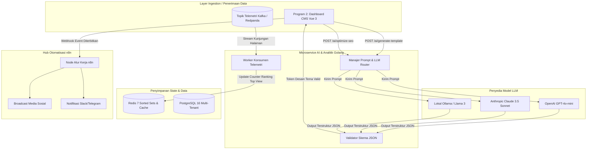

# Spesifikasi Layanan AI Agent & Analitik Data (Program 5)

## 1. Ringkasan Sistem & Rasional Desain

Program 5 adalah layanan inteligensi otonom yang dirancang untuk:
1. **Generative Design:** Membuat tema dan tata letak (layout) kustom untuk Vue 3 secara instan hanya dari instruksi bahasa manusia (*natural language prompt*).
2. **Asisten Konten & SEO:** Membantu penulisan artikel, perangkuman materi edukasi, ekstraksi kata kunci, serta optimalisasi meta tag SEO.
3. **Analitik Telemetri Pengunjung (Real-Time Top Lists):** Memproses aliran data (*telemetry streams*) dari setiap website tenant secara *real-time* untuk menghasilkan daftar konten terpopuler (Top 5 dilihat, top studi kasus portofolio, dsb.).
4. **Otomatisasi Alur Kerja (Workflow Automation):** Mengorkestrasi integrasi pihak ketiga menggunakan **n8n** (misal: otomatis broadcast artikel baru ke LinkedIn/Twitter, atau mengirim notifikasi formulir kontak ke Slack/Telegram).

Untuk mencapai performa maksimal dan efisiensi pengembangan, sistem menggunakan **Arsitektur Hybrid**:
- **Core AI Engine (Golang 1.23+):** Menangani pemrosesan data stream berkecepatan tinggi, agregasi data via Redis Sorted Sets, validasi skema JSON, dan orkestrasi pemanggilan model LLM.
- **Workflow Automation (n8n):** Menangani alur kerja integrasi pihak ketiga berbasis *low-code* melalui *webhook*.



---

## 2. Fitur 1: Generator Tema & Tata Letak Otonom (Template Synthesizer)

### 2.1 Alur Kerja (Workflow)
1. Pelanggan memasukkan instruksi teks di Dashboard CMS Vue 3:
   > *"Buatkan portofolio bernuansa gelap dan industrialis untuk seorang Senior Backend Engineer Go, lengkap dengan showcase arsitektur microservices dan proyek open source."*
2. Microservice Golang membungkus prompt dengan instruksi sistem ketat serta menerapkan format **Structured Outputs (JSON Schema)**.
3. Model LLM menghasilkan struktur data JSON valid yang mendefinisikan:
   - Palet warna (background, surface, warna primer, aksen).
   - Tipografi (kombinasi Google Fonts: misal Space Grotesk + JetBrains Mono).
   - Susunan blok layout (Hero banner bergaya terminal, Grid Studi Kasus dengan metrik performa, Cloud badge tech stack).
4. Golang memvalidasi payload terhadap skema `ThemeDesignTokens.json`.
5. Dashboard Vue 3 langsung merender *live preview* interaktif menggunakan variabel CSS dinamis (`--color-bg`, `--font-mono`).

### 2.2 Kontrak Skema JSON Desain Tema
```json
{
  "$schema": "http://json-schema.org/draft-07/schema#",
  "title": "ThemeDesignTokens",
  "type": "object",
  "required": ["theme_id", "vertical", "palette", "typography", "layout_blocks"],
  "properties": {
    "theme_id": { "type": "string" },
    "vertical": { "type": "string", "enum": ["portfolio", "blog", "education", "showcase"] },
    "palette": {
      "type": "object",
      "required": ["background", "surface", "primary", "text_primary", "accent"],
      "properties": {
        "background": { "type": "string", "pattern": "^#([A-Fa-f0-9]{6})$" },
        "surface": { "type": "string", "pattern": "^#([A-Fa-f0-9]{6})$" },
        "primary": { "type": "string", "pattern": "^#([A-Fa-f0-9]{6})$" },
        "text_primary": { "type": "string", "pattern": "^#([A-Fa-f0-9]{6})$" },
        "accent": { "type": "string", "pattern": "^#([A-Fa-f0-9]{6})$" }
      }
    },
    "typography": {
      "type": "object",
      "required": ["heading_font", "body_font", "scale_ratio"],
      "properties": {
        "heading_font": { "type": "string" },
        "body_font": { "type": "string" },
        "scale_ratio": { "type": "number", "minimum": 1.1, "maximum": 1.4 }
      }
    },
    "layout_blocks": {
      "type": "array",
      "items": {
        "type": "object",
        "required": ["block_type", "order", "props"],
        "properties": {
          "block_type": { "type": "string", "enum": ["hero_banner", "project_grid", "article_list", "timeline", "contact_card"] },
          "order": { "type": "integer" },
          "props": { "type": "object" }
        }
      }
    }
  }
}
```

---

## 3. Fitur 2: Telemetri Pengunjung & Real-Time Top-Lists

### 3.1 Alur Data & Redis Sorted Sets
Untuk mendapatkan latensi query di bawah 1 milidetik untuk fitur Top Views tanpa membebani database PostgreSQL, kita memanfaatkan **Redis Sorted Sets (`ZSET`)**:

1. **Event Kunjungan Pengunjung (Hit Beacon):**
   Setiap kontainer website tenant menyertakan pemanggilan beacon ringan di sisi browser saat halaman dibuka:
   ```javascript
   // Beacon klien sangat ringan (<1KB, tidak memblokir render)
   navigator.sendBeacon('/api/telemetry/hit', JSON.stringify({
     tenant_id: 't_982a',
     content_id: 'art_105',
     path: '/blog/distributed-consensus-raft',
     timestamp: Date.now()
   }));
   ```
2. **Penerimaan & Agregasi Event (Golang Consumer):**
   Worker Golang membaca event dari antrean dan menjalankan operasi atomik Redis:
   ```go
   // Tambah counter view sepanjang masa (all-time)
   redisClient.ZIncrBy(ctx, fmt.Sprintf("tenant:%s:content_views_all", tenantID), 1, contentID)
   
   // Tambah counter harian dengan masa kedaluwarsa (TTL) 30 hari
   dailyKey := fmt.Sprintf("tenant:%s:content_views:%s", tenantID, time.Now().Format("2006-01-02"))
   redisClient.ZIncrBy(ctx, dailyKey, 1, contentID)
   redisClient.Expire(ctx, dailyKey, 30*24*time.Hour)
   ```
3. **Pengambilan Data Top List (Query Dashboard CMS):**
   ```go
   // Mengambil 5 konten dengan jumlah view tertinggi secara instan
   topItems, err := redisClient.ZRevRangeWithScores(ctx, fmt.Sprintf("tenant:%s:content_views_all", tenantID), 0, 4).Result()
   // Latensi respon: < 0.8ms
   ```

### 3.2 Analitik Insight Otonom Harian
Setiap 24 jam (atau saat diminta), worker Golang menjalankan evaluasi data tren:
- Membandingkan metrik hari ini dengan rata-rata 7 hari sebelumnya.
- Mendeteksi anomali: *"Artikel #105 melonjak 480 pengunjung hari ini (+320% lonjakan dari referral GitHub)*".
- Menyusun saran praktis bagi pemilik website:
  - *"Tips: Topik 'Distributed Systems' sedang diminati audiens Anda. Pertimbangkan untuk menulis artikel lanjutan atau menambahkan link portofolio terkait."*
- Kartu rekomendasi ini langsung muncul di Dashboard Vue 3 pelanggan.

---

## 4. Fitur 3: Integrasi Workflow Low-Code dengan n8n

Daripada harus membuat puluhan integrasi API secara manual di Golang, sistem dilengkapi kontainer **n8n** yang terhubung via jaringan internal:

### 4.1 Contoh Skenario Otomatisasi:
1. **Saat Artikel Baru Diterbitkan (`event: content.published`):**
   - n8n menerima webhook berisi judul, ringkasan, dan URL artikel.
   - n8n secara otomatis membuat postingan promosi di akun Twitter/X, LinkedIn, atau Dev.to milik pelanggan.
2. **Saat Formulir Kontak Terisi (`event: form.submitted`):**
   - Pengunjung mengirim pesan pada portofolio pelanggan.
   - n8n meneruskan pesan tersebut langsung ke Telegram pribadi, channel Discord, atau Slack pelanggan secara instan.
3. **Digest Newsletter Mingguan (`event: cron.weekly_digest`):**
   - Mengambil 3 artikel terpopuler dari Redis Sorted Sets.
   - Menghasilkan email rekap HTML dan mengirimkannya ke daftar pelanggan via SMTP / Resend API.

---

## 5. Kontrak Antarmuka API (Go AI Service)

| Method | Endpoint | Fungsi | Payload / Respon |
| :--- | :--- | :--- | :--- |
| `POST` | `/api/v1/ai/template/generate` | Menghasilkan token desain tema baru dari teks | `{ prompt: string, vertical: string }` -> `ThemeDesignTokens` |
| `POST` | `/api/v1/ai/content/assist` | Asisten penulis (merangkum, memperpanjang, formal) | `{ text: string, mode: "summarize"\|"expand"\|"tone_formal" }` |
| `POST` | `/api/v1/ai/seo/optimize` | Ekstraksi keyword & rekomendasi meta tag | `{ title: string, content: string }` -> `{ meta_title, meta_description, keywords: [] }` |
| `GET` | `/api/v1/analytics/top-views` | Mengambil konten terpopuler milik tenant | Parameter: `?tenant_id=...&period=all\|7d\|30d&limit=5` |
| `GET` | `/api/v1/analytics/insights` | Mengambil ringkasan kartu rekomendasi AI | Parameter: `?tenant_id=...` |
