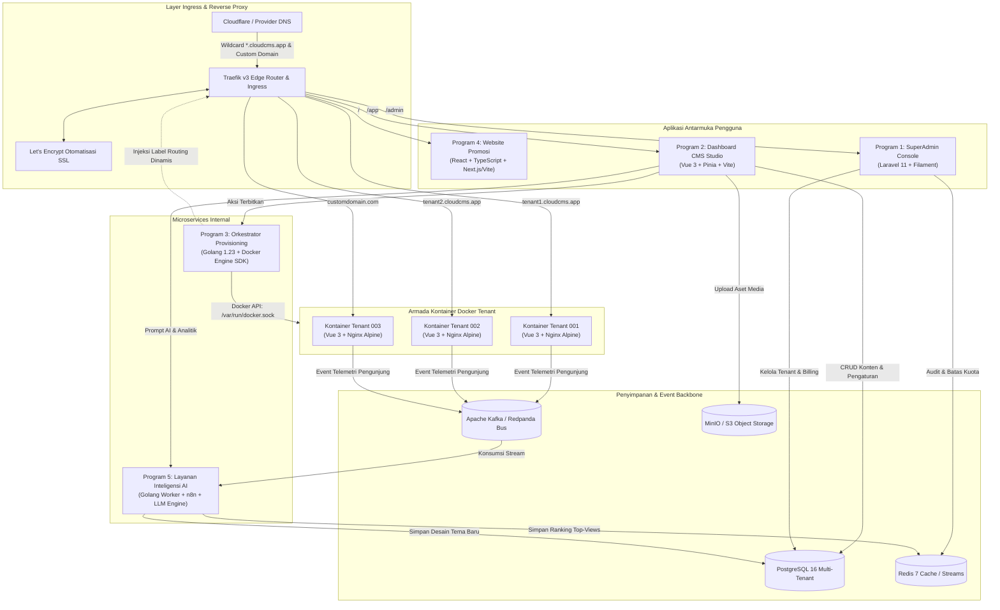
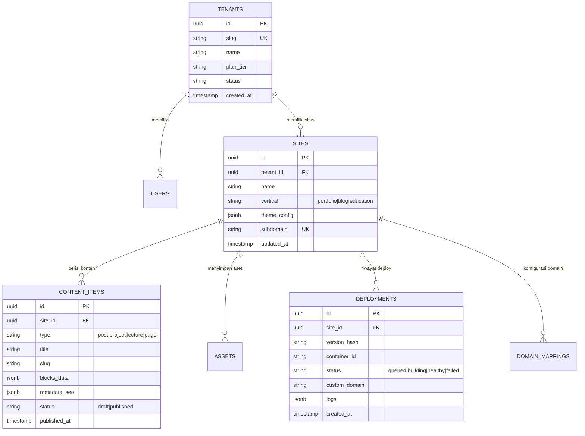

# Arsitektur Teknis & Spesifikasi Rekayasa Sistem

## 1. Komparasi Tolok Ukur Industri (Industry Benchmark)

Dalam merancang sistem CMS multi-tenant kelas enterprise, kami mengevaluasi pendekatan arsitektur dari platform global terkemuka:

| Platform | Model Arsitektur | Kelebihan | Kekurangan | Implementasi pada Sistem Kita |
| :--- | :--- | :--- | :--- | :--- |
| **Vercel / Netlify** | Edge SSR & Serverless Functions | Skalabilitas global instan, tanpa beban server persisten. | Risiko cold start, biaya compute tinggi pada skala besar. | Diterapkan pada **Website Promosi** (React SSG/SSR). |
| **Ghost Pro / Fly.io** | Kontainer / Micro-VM Terisolasi per Tenant | Isolasi penuh level OS, alokasi memori/CPU terjamin, bebas kebocoran memori antar-tenant. | Membutuhkan optimasi image kontainer agar hemat memori. | **Diterapkan untuk Website Publik Tenant (Go Orchestrator + Alpine Vue Nginx).** |
| **Shopify / WordPress VIP** | Monolitik Multi-Tenant dengan Row-Level Security | Kepadatan tinggi (jutaan toko dalam satu klaster DB). | Isolasi data di level aplikasi rumit, potensi kebocoran data jika ada celah query. | Diterapkan untuk **API Dashboard Utama & Database Konten Terpusat**. |
| **Coolify / Dokku / Railway** | Daemon Docker Lokal + Reverse Proxy Traefik | Orkestrasi kontainer bersih tanpa kompleksitas Kubernetes yang berlebihan, SSL otomatis. | Butuh manajemen state dan pengawasan orkestrator yang presisi. | **Diterapkan untuk Go Provisioning Engine + Traefik v3.** |

---

## 2. Diagram Arsitektur Sistem Menyeluruh



---

## 3. Rincian Teknis 5 Program Utama

### 3.1 Program 1: Platform Admin Console (SuperAdmin)
* **Runtime:** PHP 8.3-FPM + Nginx Alpine
* **Framework:** Laravel 11.x + FilamentPHP v3 (TALL Stack: Tailwind, Alpine.js, Laravel, Livewire)
* **Tanggung Jawab:**
  - Pengelolaan tata kelola tenant, organisasi, dan hak akses staf platform.
  - Rekonsiliasi transaksi pembayaran langganan (Webhook dari payment gateway).
  - Inspektor kesehatan server node: terhubung ke endpoint metrik Go Orchestrator untuk menampilkan CPU, RAM, kontainer aktif, dan status socket Docker.
  - Pengaturan sistem global: Toggle maintenance mode, manajemen feature flag, dan pergantian model LLM secara dinamis.
* **Akses Database:** Koneksi langsung tingkat administrator ke PostgreSQL (dapat membypass RLS untuk kebutuhan audit platform).

### 3.2 Program 2: Dashboard CMS (Tenant Studio)
* **Runtime:** Node 20 LTS (Mode Pengembangan) / Static Single Page Application (SPA) yang disajikan via Nginx atau Cloudflare Pages (Produksi).
* **Framework:** Vue 3 (Composition API dengan `<script setup>`), Vite, Pinia, Vue Router 4.
* **Komponen & UI:** Tailwind CSS, PrimeVue, Lucide Icons, Tiptap Editor v2 (headless block-based content editor).
* **Arsitektur State Management:**
  - `useAuthStore`: Autentikasi JWT, rotasi refresh token otomatis, context identitas tenant aktif.
  - `useContentStore`: Pembaruan UI optimistik (*optimistic UI updates*) untuk artikel blog, studi kasus portofolio, dan silabus edukasi.
  - `useDeployStore`: Koneksi WebSocket dua arah ke Go Orchestrator untuk menampilkan progres pembuatan kontainer secara langsung.
  - `useAiStore`: Streaming respon LLM untuk penulisan konten, rekomendasi SEO, dan pratinjau tema dinamis.
* **Fitur Utama:**
  - **Dynamic Schema Builder:** Tipe konten yang dapat disesuaikan per kategori (misal: "Studi Kasus Portofolio" dengan kolom: nama klien, teknologi yang digunakan, galeri gambar, link GitHub; atau "Artikel Blog" dengan kolom: waktu baca, markdown, URL kanonikal).
  - **Asset Manager:** Upload langsung ke MinIO / S3 via *presigned URL*, memastikan server aplikasi tidak terbebani pemrosesan file besar.

### 3.3 Program 3: API Orkestrator Provisioning & Deployment
* **Runtime:** Golang 1.23+ biner terkodifikasi mandiri (`CGO_ENABLED=0`).
* **Pustaka Utama:**
  - `github.com/gin-gonic/gin` atau `github.com/gofiber/fiber/v2` (Server REST & WebSocket berkecepatan tinggi).
  - `github.com/docker/docker/client` (Moby Docker Engine SDK resmi).
  - `github.com/redis/go-redis/v9` (Antrean tugas dan pub/sub).
* **Siklus Hidup Kontainer (Container Lifecycle):**
  1. **Pemicu Deployment:** Menerima `POST /api/v1/deploy` dengan parameter `{ tenant_id, site_id, version_hash }`.
  2. **Kompilasi Artefak Konten:** Mengambil snapshot konten JSON dan tema yang diterbitkan. Menyimpannya ke volume data `/var/cloudcms/tenants/<tenant_id>/dist`.
  3. **Pembuatan Kontainer Docker:** Memanggil Docker Engine API untuk membuat kontainer terisolasi:
     - **Image:** `cloudcms-tenant-runtime:alpine-v1` (Nginx Alpine + Bundle Klien Vue 3, berukuran sangat kecil < 25MB).
     - **Nama Kontainer:** `tenant_<tenant_id>_<version_hash>`
     - **Pembatasan Sumber Daya (Resource Constraints):**
       - `Memory: 268435456` (256 MB)
       - `MemorySwap: 268435456` (Swap dinonaktifkan untuk mencegah degradasi performa disk host)
       - `NanoCPUs: 500000000` (0.5 vCPU)
       - `PidsLimit: 50` (Mencegah serangan fork-bomb)
     - **Injeksi Label Traefik:**
       ```yaml
       traefik.enable: "true"
       traefik.docker.network: "cloudcms_edge_network"
       traefik.http.routers.tenant-<tenant_id>.rule: "Host(`<subdomain>.cloudcms.app`) || Host(`<custom_domain>`)"
       traefik.http.routers.tenant-<tenant_id>.entrypoints: "websecure"
       traefik.http.routers.tenant-<tenant_id>.tls.certresolver: "letsencrypt"
       traefik.http.services.tenant-<tenant_id>.loadbalancer.server.port: "80"
       ```
  4. **Health Check & Pengalihan Trafik (Cutover):**
     - Memeriksa endpoint internal `http://<container_ip>:80/healthz`.
     - Ketika sehat, Traefik langsung merutekan trafik ke kontainer baru secara instan.
     - Kontainer versi lama dimatikan setelah masa drain koneksi selama 15 detik (Rolling update tanpa jeda).

### 3.4 Program 4: Website Promosi & Pemasaran
* **Runtime:** Node 20 LTS / React 19 / Next.js 15 (App Router dengan Static Site Generation - SSG).
* **Bahasa:** TypeScript 5.5+.
* **Tampilan & Animasi:** Tailwind CSS, Framer Motion, Radix UI.
* **Target Kunci:**
  - Skor Core Web Vitals 100/100 di Google PageSpeed Insights.
  - **Playground Demo Interaktif:** Pengunjung dapat mencoba mengubah tema portofolio secara langsung di browser sebelum memutuskan mendaftar.
  - Artikel blog edukasi terkait tips portofolio, panduan blog, dan arsitektur web modern untuk mendatangkan traffic organik (SEO).

### 3.5 Program 5: Layanan Inteligensi AI & Analitik
* **Runtime:** Microservice Golang 1.23+ + Orkestrator Alur Kerja n8n.
* **Integrasi Model:**
  - OpenAI GPT-4o-mini (efisiensi biaya untuk penulisan konten), Anthropic Claude 3.5 Sonnet (desain tata letak kreatif), atau Model Lokal via Ollama (Llama 3 / Mistral) untuk operasi offline atau tanpa biaya API.
  - Kontainer n8n untuk integrasi webhook visual ke media sosial dan notifikasi pesan.
* **Fungsi Utama:**
  - Menghasilkan token desain tema dalam format JSON terstruktur.
  - Menghitung Top Views secara atomik melalui Redis Sorted Sets (`ZINCRBY`) untuk respon latensi sub-milidetik.

---

## 4. Arsitektur Basis Data Multi-Tenant

Sistem menggunakan model **Shared Database dengan Row-Level Security (RLS)** pada PostgreSQL 16:



### Kebijakan Keamanan Tingkat Baris (Row-Level Security):
```sql
ALTER TABLE sites ENABLE ROW LEVEL SECURITY;
ALTER TABLE content_items ENABLE ROW LEVEL SECURITY;

-- Hanya izinkan query data yang sesuai dengan session tenant saat ini
CREATE POLICY tenant_isolation_policy ON sites
    FOR ALL
    TO application_user
    USING (tenant_id = NULLIF(current_setting('app.current_tenant_id', true), '')::uuid);

CREATE POLICY tenant_content_isolation_policy ON content_items
    FOR ALL
    TO application_user
    USING (site_id IN (
        SELECT id FROM sites WHERE tenant_id = NULLIF(current_setting('app.current_tenant_id', true), '')::uuid
    ));
```

---

## 5. Arsitektur Jaringan & Isolasi Docker

```mermaid
graph TD
    subgraph Host_Sistem [Host Linux Kernel dengan cgroups v2 & Iptables]
        subgraph Edge_Net [Bridge Publik: cloudcms_edge_network]
            TRAEFIK_PROXY[Traefik Edge Proxy]
        end

        subgraph Core_Net [Network Internal: cloudcms_internal_net]
            ORCHESTRATOR[Orkestrator Provisioning Go]
            LARAVEL_ADMIN[Laravel SuperAdmin]
            AI_SERVICE[Layanan AI Go]
            PG_DB[(PostgreSQL 16)]
            REDIS_INST[(Redis 7)]
        end

        subgraph Tenant_Net [Network Tenant Terisolasi: cloudcms_tenants_net]
            T_CONT1[Kontainer Tenant 1]
            T_CONT2[Kontainer Tenant 2]
            T_CONTn[Kontainer Tenant N]
        end
    end

    TRAEFIK_PROXY -->|Port Publik 80, 443| Internet((Internet Publik))
    TRAEFIK_PROXY -.->|Meneruskan trafik website| Tenant_Net
    TRAEFIK_PROXY -.->|Meneruskan admin/dashboard| Core_Net
    
    ORCHESTRATOR -->|Mengelola Kontainer via Socket| Host_Sistem
    ORCHESTRATOR --> Core_Net
    
    %% Kontainer tenant DIBLOKIR dari network internal
    T_CONT1 -.x|DIBLOKIR Firewall Iptables| Core_Net
    T_CONT2 -.x|DIBLOKIR Firewall Iptables| Core_Net
```

Kontainer website tenant memiliki isolasi keamanan ketat:
- Berada di jaringan terpisah (`cloudcms_tenants_net`).
- Firewall iptables secara tegas menolak paket data dari kontainer tenant yang mencoba mengakses jaringan internal (`cloudcms_internal_net`), sehingga tenant **tidak dapat mengakses** PostgreSQL, Redis, maupun Docker socket.
