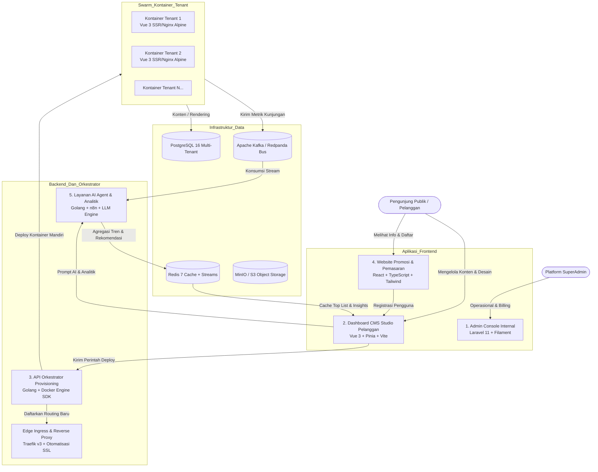

# Dokumen Kebutuhan Produk (PRD)
## Platform Cloud CMS Multi-Tenant & Orkestrasi Kontainer Otonom

| Metadata | Spesifikasi |
| :--- | :--- |
| **Versi Dokumen** | 1.0.0-PROD (Bahasa Indonesia) |
| **Status** | Disetujui sebagai Baseline Arsitektur & Rekayasa Sistem |
| **Penulis** | Principal Solutions Architect & Engineering Lead |
| **Target Peluncuran** | Fase 1 MVP (Q3 2026) -> Fase 2 Rilis Penuh (Q4 2026) |
| **Cakupan Sistem** | 5 Layanan Utama Independen + Infrastruktur Terdistribusi |

---

## 1. Ringkasan Eksekutif & Visi Produk

### 1.1 Latar Belakang & Masalah
Di era digital saat ini, pembuat konten, software engineer, institusi pendidikan, dan bisnis mikro sering menghadapi dilema besar dalam memilih platform CMS:
1. **CMS Monolitik Tradisional (misal: WordPress, Drupal):** Rentan terhadap celah keamanan plugin, konsumsi memori tinggi, lambat saat diakses, dan konfigurasi server yang rumit.
2. **Platform Modern Headless / Static Site (misal: Vercel + Strapi, Ghost Pro):** Membutuhkan keahlian teknis tinggi untuk konfigurasi awal, biaya langganan sangat mahal untuk multi-situs, dan kurangnya kontrol penuh atas orkestrasi kontainer mandiri.

### 1.2 Visi Produk
Membangun platform CMS multi-tenant generasi baru berkinerja tinggi yang menggabungkan kemudahan editor visual (*no-code*) dengan otomatisasi DevOps otonom. Pengguna mendaftar, menyesuaikan tampilan situs secara visual atau dipandu asisten AI, lalu menekan tombol **"Terbitkan" (Publish)**. Dalam hitungan detik (< 4.5 detik), sistem secara otomatis mem-provisioning kontainer Docker terisolasi yang langsung siap diakses publik dengan domain kustom, sertifikat SSL otomatis, dan perlindungan keamanan ketat.

### 1.3 Target Pengguna & Kasus Penggunaan (Use Cases)
1. **Website Portofolio Profesional:**
   - Untuk software engineer, desainer UI/UX, fotografer, dan agensi kreatif.
   - Fitur: Showcase studi kasus interaktif, integrasi riwayat proyek GitHub, download CV/resume, formulir kontak dengan webhook ke Telegram/Slack.
2. **Blog Publikasi & Media Editorial:**
   - Untuk penulis independen dan tim media komunitas.
   - Fitur: Manajemen banyak penulis (multi-author), editor visual berbasis blok (Tiptap), estimasi waktu baca (*reading time*), feed RSS, hierarki kategori/tag, serta generator otomatis gambar preview media sosial (OpenGraph).
3. **Pusat Edukasi, Akademik & Dokumentasi:**
   - Untuk sekolah, universitas, kursus daring, atau komunitas teknologi.
   - Fitur: Struktur kurikulum/silabus bertingkat, publikasi modul materi ajar, profil pengajar/dosen, serta pencarian dokumentasi cepat.
4. **Katalog Produk & Showcase Bisnis Mikro (Nilai Tambah):**
   - Menampilkan katalog produk atau jasa secara profesional dengan tombol order instan langsung mengarah ke WhatsApp atau payment link (Midtrans/Xendit/Stripe).

---

## 2. Topologi Sistem Tingkat Tinggi (5 Program Utama)

Sistem dirancang sebagai arsitektur *microservices* terdistribusi yang saling terhubung:

---

## 3. Spesifikasi Mendalam untuk 5 Program

### Program 1: Platform Admin Console (SuperAdmin)
* **Teknologi:** Laravel 11 (PHP 8.3), FilamentPHP v3, Tailwind CSS, PostgreSQL.
* **Alasan Pemilihan:** Laravel sangat matang untuk panel administrasi internal, memiliki ekosistem autentikasi yang kuat, pengelolaan kebijakan (*policies/RBAC*), audit logging, dan waktu pengembangan yang sangat cepat tanpa beban overhead berlebih.
* **Target Pengguna:** Pemilik Platform, Tim DevOps, Spesialis Dukungan Pelanggan (*Customer Support*), dan Bagian Keuangan.
* **Fitur Utama:**
  1. **Manajemen Siklus Hidup Tenant & Langganan:**
     - Mencari, memeriksa, menangguhkan (*suspend*), mengatur batas (*quota*), atau menghapus instance tenant.
     - Mengelola paket langganan (Free, Pro, Enterprise) yang menentukan alokasi sumber daya (misal: batas 1 kontainer, storage 500MB, 50.000 kunjungan per bulan).
  2. **Telemetri Node & Kontainer Docker:**
     - Menampilkan inventaris kontainer Docker aktif di seluruh server worker.
     - Memantau penggunaan CPU, RAM, dan status kesehatan socket Docker secara *real-time*.
  3. **Pengawasan Kuota & Biaya AI:**
     - Memantau konsumsi token LLM per tenant, biaya penggunaan, rate limit, dan latensi respon.
  4. **Log Audit & Keamanan:**
     - Pencatatan riwayat setiap tindakan administratif, fitur *impersonation login* (untuk kebutuhan bantuan teknis ke pelanggan), dan pembatasan IP whitelist admin.

---

### Program 2: Dashboard CMS (HeroCMS Studio - Portal Pelanggan)
* **Teknologi:** Vue 3 (Composition API), Vite, Pinia (State Management), Vue Router, Vanilla CSS Modern (Design Tokens sejalan dengan Marketing Site), Tiptap / Visual Block Engine, Lucide Icons.
* **Target Pengguna (Persona):** Pelanggan akhir (end-customers) seperti software engineer, konten kreator, blogger independen, agensi, dan pemilik bisnis mikro yang ingin membuat serta menerbitkan website mandiri tanpa perlu mengelola server secara manual.
* **Model Bisnis (CaaS - Container-as-a-Service CMS):**
  - Pelanggan berlangganan paket yang memberikan kuota kontainer Docker terisolasi (misal: Starter `0/1 Kontainer`, Pro `1/3 Kontainer`, Business `3/5 Kontainer`, Enterprise `10+ Kontainer`).
  - Setiap website berjalan di dalam kontainer Docker terdedikasi miliknya sendiri dengan alokasi cgroups CPU dan memori RAM terisolasi.
* **Arsitektur Menu & Navigasi HeroCMS Studio (10 Modul Enterprise):**
  1. **Situs & Kontainer (My Containers & Multi-Site Hub):**
     - Indikator pemakaian kuota kontainer pelanggan (misal: `1/3 Kontainer Digunakan`, `2 Slot Kosong`).
     - Kartu status agregat (Total Kunjungan, Rata-rata Latensi TTFB Edge Traefik, Health Check server).
     - Tombol aksi cepat *"Buat Website Baru (+ Buat Kontainer)"*.
     - Daftar kartu seluruh kontainer milik pelanggan dengan visual status yang jelas (`Running`, `Stopped`, `Provisioning`, `Degraded`).
     - **Kontrol Siklus Hidup Kontainer (CRUD Runtime):** Start, Stop, Restart, Hapus (Destroy) dengan cgroups v2 resource limit (0.5 vCPU, 256MB RAM) dan streaming live logs.
  2. **Editor Desain & Konten Visual (Studio Visual Page Builder):**
     - Editor visual tingkat lanjut untuk menyesuaikan konten dan tata letak secara *live*:
       - Header & Hero Section, Blok Konten Modular, Gaya & Desain Global (Color tokens, typography, border radius).
       - Simulator Responsif 3-Perangkat: Pratinjau langsung untuk mode Desktop, Tablet, dan Mobile.
       - Tombol *"Terbitkan ke Kontainer (Live)"*: Memicu pembaruan instan ke kontainer Docker aktif dalam hitungan detik.
  3. **Pengelola Konten: Artikel & Halaman (Publishing Engine):**
     - Manajemen artikel blog, studi kasus, dan halaman statis mandiri terpisah dari layout builder.
     - Status artikel (`Published`, `Draft`), slug URL SEO-friendly otomatis, kategori, penghitung views, dan modal penulisan artikel baru.
  4. **Media Library & Penyimpanan S3 (Asset Storage Engine):**
     - Galeri aset gambar terpusat yang terintegrasi dengan S3/MinIO bucket.
     - Progress meter penggunaan penyimpanan cloud (misal: `120 MB / 2 GB`), filter dimensi/tipe, dan upload instan.
  5. **Katalog Template & Toko Tema (Curated Template Store):**
     - Pilihan template resmi berstandar industri: Portofolio Teknis, Blog Media & Editorial, Pusat Edukasi & LMS, Showcase Bisnis Mikro & UMKM.
     - Tiering Lisensi Template: *Standard Template* gratis dalam paket, *Pro / Premium Template* dengan layout dan micro-animasi eksklusif.
  6. **Custom Domain & Pengaturan DNS (Traefik Edge Network):**
     - Alokasi subdomain otomatis (`https://<nama-tenant>.cloudcms.app`).
     - Pasang Custom Domain pribadi (misal: `https://bisnisku.com`) dengan tabel panduan DNS CNAME & A-Record Traefik.
     - Pengecekan propagasi DNS dan penerbitan sertifikat SSL otomatis Let's Encrypt TLS v1.3.
  7. **Analitik Real-Time & Wawasan Pengunjung (Telemetry Insights):**
     - Agregasi data hit pengunjung secepat kilat menggunakan Redis Sorted Sets (`ZSET`) dan bus event Kafka non-blocking.
     - Peringkat artikel/halaman terpopuler secara real-time (*Top 5 Most Viewed*).
     - Grafik tren kunjungan harian, negara asal pengunjung, dan waktu muat rata-rata (TTFB 1.8ms).
  8. **Webhooks & API Keys (Developer & Headless Integrations):**
     - Pengelolaan token API Tenant (Developer Access) untuk integrasi headless CMS dan CI/CD pipeline via cURL/SDK.
     - Konfigurasi endpoint Webhook keluar (Discord, Slack, Telegram, WhatsApp gateway) saat event publikasi atau pengiriman formulir pengunjung.
  9. **Kapasitas & Paket Langganan (Resource Allocation & Plans):**
     - Rincian alokasi cgroups (CPU, RAM, Bandwidth) paket aktif pelanggan.
     - Tambah slot kontainer on-demand (+1 kontainer Docker) dan opsi upgrade tiering transparan.
  10. **Faktur Pajak & Riwayat Tagihan Resmi (SaaS Billing Ledger):**
      - Riwayat faktur resmi ber-NPWP PT Hero Digital Multitek untuk pembukuan dan pajak perusahaan pelanggan.
      - Status pembayaran lunas terverifikasi bank, kalkulasi PPN 11% otomatis sesuai regulasi, dan unduh bukti pembayaran faktur teks/PDF.

* **Integrasi Mandatori Progressive Web App (PWA) untuk Seluruh Dashboard:**
  Semua program dashboard platform (baik **Program 2: Dashboard CMS Studio Pelanggan** maupun **Program 1: SuperAdmin Console**) **wajib mendukung Progressive Web App (PWA)** secara penuh untuk menghadirkan pengalaman aplikasi desktop & mobile natif:
  1. **Web App Manifest Standar Industri (`manifest.webmanifest`):**
     - **Identitas Aplikasi:** `name: "HeroCMS Studio"`, `short_name: "HeroStudio"`, `start_url: "/"`.
     - **Tampilan Standalone:** `display: "standalone"`, `orientation: "any"`, menghilangkan seluruh chrome/address bar browser sehingga terasa 100% seperti aplikasi native desktop (macOS/Windows/Linux) dan mobile (Android/iOS).
     - **Theming & Palet Warna:** `theme_color: "#09090b"` (menyesuaikan status bar mobile/desktop), `background_color: "#ffffff"`.
     - **Ikon Adaptif & Maskable:** Menyediakan ikon resolusi tinggi 192x192, 512x512, SVG vektor tajam, dan ikon *maskable* untuk adaptasi bentuk ikon di Android.
     - **App Shortcuts Launcher:** Shortcut cepat langsung dari ikon aplikasi di taskbar/homescreen:
       - *"Deploy Baru"* -> mengarah langsung ke modal pembuatan kontainer.
       - *"Tulis Artikel"* -> mengarah langsung ke modul penulisan artikel.
       - *"Telemetri"* -> membuka ringkasan analitik real-time.
  2. **Strategi Caching Multi-Tier via Service Worker (Workbox / Vite PWA):**
     - **Tier 1 - App Shell Pre-caching (Cache-First):** Bundle HTML, file JS Vue terkompilasi, CSS, font (Plus Jakarta Sans/Inter), dan ikon Lucide di-pre-cache. Hasilnya: aplikasi terbuka seketika (*instant startup < 200ms*) bahkan saat offline atau jaringan lambat.
     - **Tier 2 - Dynamic Telemetry & Container Control (Network-First with Fallback):** Data kritis seperti streaming log kontainer Docker, metrik Kafka, dan status penagihan menggunakan strategi *Network-First* untuk menjamin data selalu segar dari server origin. Jika koneksi terputus, Service Worker menyajikan state snapshot terakhir dari cache lokal dengan indikator visual *"Mode Offline - Data Terakhir Tersimpan"*.
     - **Tier 3 - Media Assets & Templates (Stale-While-Revalidate):** Thumbnail gambar S3 dan pratinjau template disimpan dalam cache lokal terpisah dengan batasan ukuran (LRU cache max 50MB) agar galeri media terbuka sangat cepat tanpa menguras kuota bandwidth.
  3. **Penulisan Konten Offline (Offline Drafting & Background Sync):**
     - Tenant dapat terus mengetik dan mengedit artikel serta konfigurasi tema meskipun koneksi internet terputus (data tersimpan di IndexedDB browser).
     - Memanfaatkan **Background Sync API** untuk secara otomatis menyinkronkan draf artikel dan konfigurasi situs ke backend begitu perangkat kembali terhubung ke jaringan internet.
  4. **Notifikasi Web Push (Web Push Notifications API):**
     - Pengiriman notifikasi push langsung ke desktop/ponsel tenant (menggunakan kunci VAPID terenkripsi):
       - Notifikasi saat deployment kontainer selesai (*"Kontainer portofolio Anda telah aktif online di routing Traefik"*).
       - Peringatan keamanan atau lonjakan trafik (*"Trafik website meningkat 300% dalam 10 menit terakhir"*).
       - Pengingat siklus penagihan dan konfirmasi pelunasan faktur invoice resmi.
  5. **Antarmuka Instalasi Natif (In-App Install Prompt Banner):**
     - Dashboard mendeteksi event browser `beforeinstallprompt` dan menampilkan banner elegan *"Pasang HeroCMS Studio di Perangkat Anda"* yang tidak mengganggu di header dashboard, mempermudah akses sekali-klik bagi pengguna.

---

### Program 3: API Orkestrator Provisioning & Deployment
* **Teknologi:** Go (Golang 1.23+), Gin / Fiber Framework, Moby Docker Engine SDK resmi (`github.com/docker/docker/client`).
* **Alasan Pemilihan:** Golang dikompilasi menjadi binary mandiri berkinerja tinggi dengan efisiensi memori ekstrem, penanganan konkurensi goroutine yang hebat, serta dukungan pustaka resmi untuk mengendalikan Docker Engine dan cgroups Linux secara langsung.
* **Fitur Utama:**
  1. **Pipeline Deployment Otomatis:**
     - Menerima event publikasi dari Dashboard CMS.
     - Menyusun artefak konten dan aset tema ke dalam runtime kontainer yang telah dikeraskan (*hardened base image: Alpine Vue Nginx*).
     - Menghubungkan kontainer baru ke proxy Traefik melalui injeksi Docker labels dinamis:
       - `traefik.enable=true`
       - `traefik.http.routers.<tenant-id>.rule=Host('<subdomain>.domain.com') || Host('<custom-domain>')`
       - `traefik.http.routers.<tenant-id>.tls.certresolver=letsencrypt`
  2. **Sandboxing Kontainer & Isolasi Sumber Daya:**
     - Membatasi konsumsi resource via cgroups Linux: `Memory: 256MB`, `NanoCPUs: 500000000` (maksimal 0.5 core CPU).
     - Filesystem read-only (`--read-only`) dengan partisi memori RAM ephemeral (`tmpfs`).
     - Hak akses non-root (`UID 10001`), serta pencabutan seluruh Linux capabilities (`cap-drop: ALL`).
  3. **Rolling Update Zero-Downtime (Blue/Green Deployment):**
     - Setiap pembaruan situs memicu pembuatan Kontainer Baru (Green).
     - Menjalankan *health-check* internal; jika sukses, rute Traefik dialihkan seketika ke kontainer baru.
     - Kontainer lama (Blue) dihentikan secara bertahap tanpa adanya *downtime*.
  4. **Garbage Collection & Pemulihan Mandiri (Self-Healing):**
     - Daemon pengawas berkala membersihkan kontainer yatim (*orphaned containers*), image usang, dan me-restart kontainer yang mengalami gangguan otomatis.

---

### Program 4: Website Promosi & Pemasaran (Marketing Landing)
* **Teknologi:** React 19 / 18, TypeScript, Next.js (App Router, SSG/SSR) atau Vite + Tailwind CSS, Framer Motion.
* **Alasan Pemilihan:** Optimalisasi SEO mutlak (skor 100/100 Core Web Vitals), waktu muat pertama sangat cepat (*instant Time-To-Interactive*), tampilan visual memukau dengan micro-animation yang mulus, serta konversi pendaftaran tinggi.
* **Fitur Utama:**
  1. **Halaman Utama Berkonversi Tinggi:**
     - Hero section dengan widget *Live Interactive Demo Playground* (pengunjung dapat mengutak-atik tema portofolio secara langsung di browser tanpa perlu registrasi).
     - Penjelasan fitur spesifik untuk Portofolio, Blogger, Institusi Edukasi, dan Pengembang Perangkat Lunak.
     - Kalkulator harga interaktif transparan.
  2. **Galeri & Showcase Tema:**
     - Menampilkan contoh-contoh website yang dibuat menggunakan platform ini.
     - Tombol *"Gunakan Tema Ini"* yang langsung membawa pengguna ke proses onboarding.
  3. **Alur Onboarding Cepat:**
     - Wizard pendaftaran: *Pilih Kategori -> Pilih Tema Awal -> Tentukan Nama Subdomain -> Buat Akun*.

---

### Program 5: Layanan AI Agent & Analitik Data
* **Teknologi:** Microservice Golang 1.23+ + Orkestrasi n8n + Integrasi Multi-LLM (OpenAI, Anthropic, dan Lokal Ollama/Llama 3).
* **Alasan Pemilihan:** Menggabungkan kecepatan komputasi numerik Golang untuk agregasi data telemetri dengan fleksibilitas alur kerja visual n8n.
* **Fitur Utama:**
  1. **Sintesis Tema & Tata Letak Berbasis AI:**
     - Mengubah prompt instruksi teks menjadi skema JSON token desain yang siap dirender secara langsung oleh Dashboard Vue 3.
  2. **Kopilot Konten & Optimasi SEO:**
     - Ekstraksi kata kunci utama, analisis keterbacaan artikel, pembuatan judul dan deskripsi meta yang dioptimalkan untuk mesin pencari.
  3. **Agregasi Analitik Pengunjung & Daftar Populer (Top Lists):**
     - Mengonsumsi data klik dan kunjungan dari antrean Kafka/Redis Streams.
     - Menyimpan dan menghitung peringkat artikel terpopuler (*Top 5 Views*) menggunakan Redis Sorted Sets (`ZSET`) dengan latensi respon kurang dari 1 milidetik.
     - Menghasilkan ringkasan mingguan otomatis untuk pemilik website (*"Artikel Anda tentang microservices mengalami peningkatan kunjungan 42% hari ini"*).
  4. **Integrasi Automasi n8n:**
     - Menghubungkan aksi publikasi konten ke platform eksternal seperti publikasi otomatis ke media sosial atau pengiriman notifikasi form kontak ke Telegram/Discord.

---

## 4. Kebutuhan Non-Fungsional (NFR)

| Aspek | Standar & Target Metrik |
| :--- | :--- |
| **Ketersediaan (Availability)** | SLA 99.9% uptime untuk seluruh situs publik tenant. |
| **Kecepatan Deployment** | Waktu dari klik "Terbitkan" hingga situs aktif online < 4.5 detik. |
| **Waktu Respon (Latency)** | Waktu TTFB (Time to First Byte) cache edge < 80ms; TTFB dinamis origin < 250ms. |
| **Kepatuhan PWA & Offline** | Skor Google Lighthouse PWA >= 95/100; Startup App Shell < 200ms saat offline. |
| **Instalabilitas Aplikasi** | Lolos audit Web App Manifest (standalone display, valid icons, service worker registered). |
| **Skalabilitas Node** | Satu server worker mampu menampung hingga 1.000 kontainer tenant aktif secara efisien. |
| **Keamanan** | Isolasi kontainer penuh (tanpa eskalasi hak akses); rating SSL A+ di Qualys SSL Labs. |
| **Integritas Data** | Backup berkala basis data PostgreSQL point-in-time recovery (PITR) dan snapshot media setiap jam. |

---

## 5. Rencana Tahapan Rilis (Roadmap)

* **Fase 1: Fondasi Arsitektur & Core Engine (Bulan 1)**
  - Setup struktur monorepo, konfigurasi docker-compose infrastruktur bersama (Traefik, Postgres, Redis, Redpanda, MinIO).
  - Skema basis data PostgreSQL dengan dukungan Row-Level Security (RLS).
  - Pembuatan prototipe Go Provisioning Engine: pembuatan kontainer via Docker SDK dan routing dinamis Traefik.
* **Fase 2: Admin Console & Dashboard CMS Studio (Bulan 2)**
  - Pembuatan Admin Console Laravel 11 (monitoring tenant dan status resource).
  - Pembuatan Dashboard Studio Vue 3 dengan block editor dan pengatur tema visual.
  - Alur upload aset media langsung ke S3/MinIO.
* **Fase 3: Layanan AI Agent & Website Promosi (Bulan 3)**
  - Implementasi microservice AI Golang (generator tema JSON dan pengolah data Top-Views via Redis Sorted Sets).
  - Integrasi n8n untuk webhook otomatisasi.
  - Website promosi React + TypeScript dengan fitur demo playground interaktif.
* **Fase 4: Pengerasan Keamanan, Uji Beban & Peluncuran Produksi (Bulan 4)**
  - Penerapan profil keamanan cgroups Linux, hak akses non-root, dan audit seccomp.
  - Stress testing & load testing hingga 1.000 kontainer simultan.
  - Peluncuran publik resmi dengan pipeline CI/CD otomatis.
