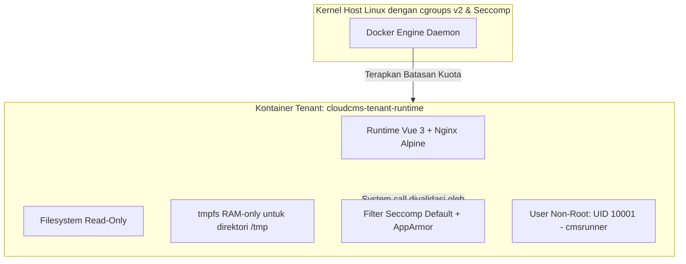
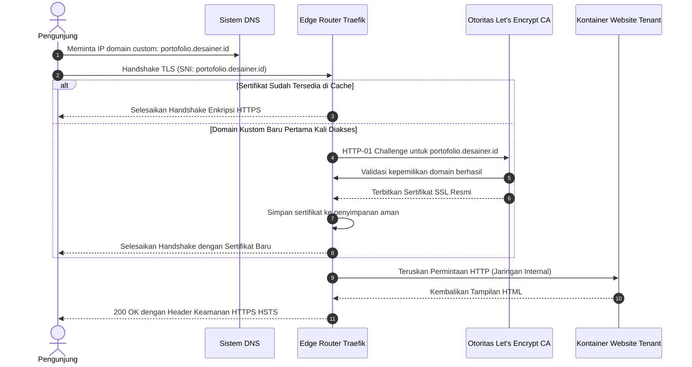

# Arsitektur Keamanan, Sandboxing Kontainer & Kepatuhan

## 1. Pemodelan Ancaman (Threat Modeling) & Strategi Defense-in-Depth

Menjalankan platform multi-tenant di mana kode, tema, dan konten kustom dari ribuan pengguna dijalankan dalam kontainer Docker menimbulkan beberapa potensi celah keamanan kritis:
1. **Container Escape (Pelarian Kontainer) & Eskalasi Hak Akses:** Penyerang yang menyisipkan skrip berbahaya mencoba membobol kontainer untuk menguasai sistem operasi server host.
2. **Kebocoran Data Antar-Tenant (Cross-Tenant Data Bleed):** Tenant A mencoba mengakses draf artikel, dokumen rahasia, atau data analitik milik Tenant B.
3. **Pergerakan Lateral Infrastruktur Internal:** Kontainer tenant yang terkompromi memindai (*network scanning*) port internal untuk menyerang PostgreSQL, Redis, Kafka, atau Docker socket.
4. **Denial of Service (DoS / Monopoli Sumber Daya):** Salah satu website tenant mengonsumsi 100% CPU atau RAM host sehingga melumpuhkan website milik tenant lainnya.
5. **Stored XSS & SSRF:** Konten pengguna menyuntikkan skrip jahat ke browser pengunjung atau fitur webhook dimanipulasi untuk menyerang IP privat/cloud metadata internal.

---

## 2. Pengerasan (Hardening) & Sandboxing Kontainer Docker

Setiap kontainer website tenant yang dibuat oleh Go Orchestrator **WAJIB** mematuhi parameter pengerasan berikut:



### 2.1 Matriks Konfigurasi Pengerasan Kontainer

| Parameter | Nilai Konfigurasi | Tujuan & Manfaat Keamanan |
| :--- | :--- | :--- |
| **Hak Akses User** | `User: "10001:10001"` (`cmsrunner`) | Memastikan kontainer tidak pernah berjalan sebagai user root (UID 0). |
| **Eskalasi Akses** | `SecurityOpt: ["no-new-privileges:true"]` | Mencegah file biner berbahaya memperoleh hak istimewa tambahan. |
| **Status Filesystem** | `ReadonlyRootfs: true` | Mencegah malware atau skrip peretas menulis file baru ke disk sistem. |
| **Area Tulis Sementara** | `Tmpfs: {"/tmp": "size=16M,noexec,nosuid,nodev"}` | File sementara hanya disimpan di RAM; eksekusi biner diblokir total (`noexec`). |
| **Pencabutan Capabilities**| `CapDrop: ["ALL"]`, `CapAdd: ["NET_BIND_SERVICE"]` | Menghilangkan seluruh kapabilitas root Linux, hanya menyisakan izin membuka port 80/443. |
| **Batas Penggunaan CPU** | `NanoCPUs: 500000000` (Maksimal 0.5 vCPU) | Mencegah script looping atau penambangan kripto melumpuhkan CPU server. |
| **Batas Penggunaan RAM** | `Memory: 268435456` (256 MB), swap dinonaktifkan | Mencegah Out-Of-Memory (OOM) yang dapat merusak stabilitas host. |
| **Batas Jumlah Proses** | `PidsLimit: 50` | Memblokir serangan pembengkakan proses (*fork-bomb*). |
| **Isolasi Jaringan** | Bridge terisolasi tanpa akses ke Docker socket | Mencegah penyerangan secara lateral ke infrastruktur inti. |

### 2.2 Cuplikan Kode Konfigurasi pada Go Orchestrator
```go
// Parameter pembuatan kontainer yang diwajibkan oleh Go Orchestrator
config := &container.Config{
    Image:        "cloudcms-tenant-runtime:alpine-v1",
    User:         "10001:10001", // Non-root user
    Tty:          false,
    AttachStdin:  false,
    Env: []string{
        "NODE_ENV=production",
        fmt.Sprintf("TENANT_ID=%s", tenantID),
        fmt.Sprintf("SITE_ID=%s", siteID),
    },
}

hostConfig := &container.HostConfig{
    Resources: container.Resources{
        Memory:     256 * 1024 * 1024, // Maksimal 256 MB
        MemorySwap: 256 * 1024 * 1024, // Tanpa swap
        NanoCPUs:   500000000,         // 0.5 Core CPU
        PidsLimit:  func(i int64) *int64 { return &i }(50),
    },
    ReadonlyRootfs: true, // Filesystem hanya-baca
    SecurityOpt: []string{
        "no-new-privileges:true",
    },
    CapDrop: []string{"ALL"},                // Cabut semua kapabilitas root
    CapAdd:  []string{"NET_BIND_SERVICE"},   // Hanya izinkan port web
    Tmpfs: map[string]string{
        "/tmp": "size=16m,noexec,nosuid,nodev",
        "/run": "size=4m,noexec,nosuid,nodev",
    },
    RestartPolicy: container.RestartPolicy{
        Name: "on-failure",
        MaximumRetryCount: 3,
    },
}
```

---

## 3. Mitigasi Risiko Keamanan OWASP Top 10

### 3.1 A01: Broken Access Control & Segregasi Data Multi-Tenant
- **Pencegahan:** Tenant ID ditanam secara kriptografis dalam token JWT bertanda tangan digital saat login.
- **Penegakan di PostgreSQL:** Setiap koneksi database aplikasi mengaktifkan parameter session:
  ```sql
  SET LOCAL app.current_tenant_id = 'c56a4180-65aa-42ec-a945-5fd21dec0538';
  ```
- Seluruh query data konten wajib melewati aturan Row-Level Security (RLS). Sekalipun programmer lupa menuliskan klausa `WHERE tenant_id = ?`, database tetap secara otomatis menolak data dari tenant lain.

### 3.2 A03: Pencegahan Serangan Injeksi (SQLi & Command Injection)
- **SQL Injection:** Seluruh query SQL 100% menggunakan parameter binding terstruktur melalui pustaka Go `pgx` dan Eloquent ORM di Laravel. Tidak ada perangkaian string manual (`raw string concatenation`).
- **Command Injection:** Go Orchestrator sama sekali tidak memanggil perintah bash/shell sistem (`exec.Command("docker ...")`). Seluruh komunikasi dikirimkan melalui struktur data biner langsung ke API Unix socket `/var/run/docker.sock`.

### 3.3 A07: Cross-Site Scripting (XSS)
- Editor konten visual (Tiptap pada Dashboard Vue 3) menyimpan dokumen dalam format Abstract Syntax Tree (JSON ProseMirror), bukan string raw HTML mentah.
- Saat dirender ke pengunjung, seluruh teks disanitasi menggunakan pustaka **DOMPurify** dengan whitelist tag ketat.
- Header Content Security Policy (CSP) ketat disuntikkan oleh Traefik:
  ```http
  Content-Security-Policy: default-src 'self'; script-src 'self'; style-src 'self' 'unsafe-inline' https://fonts.googleapis.com; img-src 'self' data: https://storage.cloudcms.app; connect-src 'self'; frame-ancestors 'none';
  ```

### 3.4 Perlindungan Terhadap SSRF (Server-Side Request Forgery)
- Pengguna dapat mengatur webhook keluar (misal pengiriman form kontak ke URL eksternal).
- Seluruh pemanggilan webhook dilewatkan melalui proxy filter DNS yang secara otomatis memblokir:
  - Alamat IP privat lokal: `10.0.0.0/8`, `172.16.0.0/12`, `192.168.0.0/16`, `127.0.0.0/8`.
  - Endpoint metadata cloud provider: `169.254.169.254` (mencegah pencurian kredensial AWS/GCP).

---

## 4. Keamanan Edge, Domain Kustom & Otomatisasi SSL

Traefik v3 bertindak sebagai gerbang terdepan (*reverse proxy*) yang menangani enkripsi TLS/HTTPS secara otomatis:



### Pembatasan Laju Trafik (Rate Limiting)
- Pembatasan Ingress: Maksimal 120 permintaan per menit per IP address untuk penelusuran normal; dan maksimal 5 permintaan per menit untuk endpoint sensitif (login dan reset password).
- Proteksi DDoS: Menggunakan Cloudflare di layer terdepan untuk menyaring serangan Layer 3, Layer 4, dan Layer 7 sebelum mencapai Traefik server kita.
